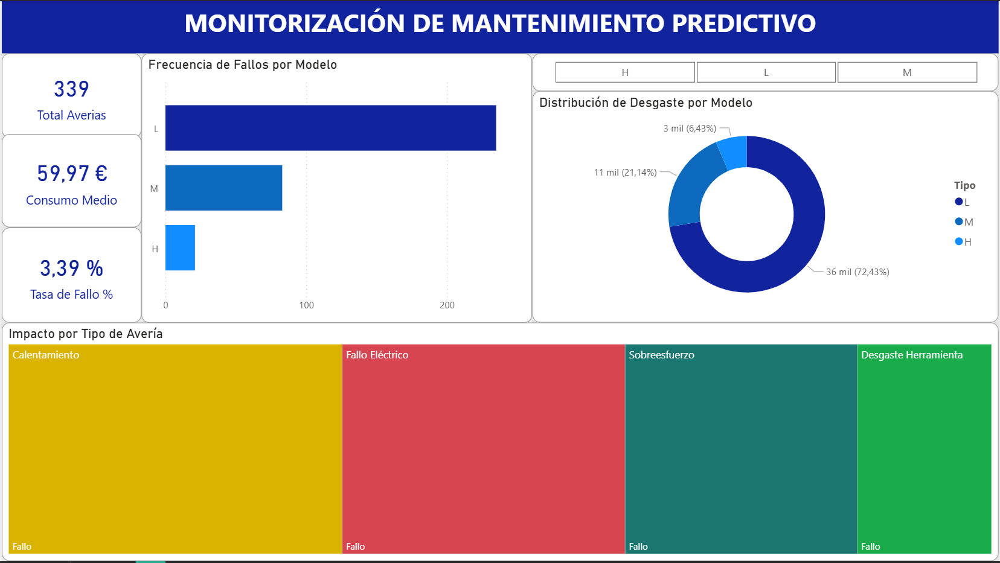

# Proyecto de Monitoreo y Mantenimiento Predictivo Industrial

Este proyecto automatiza el ciclo completo de datos (ETL, almacenamiento y análisis) de sensores industriales para identificar patrones de fallo y optimizar el consumo de maquinaria. Basado en un dataset de mantenimiento preventivo, el objetivo es transformar registros brutos en decisiones de negocio y visualizarlas en un entorno de Business Intelligence profesional.

## Tecnologías utilizadas
* **Python**: Pandas para procesamiento y Seaborn/Matplotlib para visualización técnica.
* **MySQL**: Almacenamiento y gestión de datos relacionales.
* **SQLAlchemy**: Librería para la conexión eficiente entre Python y SQL.
* **Power BI**: Diseño de Dashboard interactivo y cálculo de medidas DAX para KPIs de negocio.

## Hallazgos y Conclusiones del Análisis
Tras procesar 10,000 registros de sensores y analizar los resultados en SQL y Power BI, se extraen las siguientes conclusiones:

1. **Índice de Sobreesfuerzo Mecánico:** Las máquinas que operan con un **Índice de Esfuerzo Mecánico** elevado presentan **3.7 veces más probabilidades de fallar**. Este índice se convierte en el principal KPI preventivo para activar alertas tempranas.

2. **Correlación Operativa:** Se observa una correlación del **0.98** entre el **Torque** y el **Índice de Esfuerzo Mecánico**, lo que confirma que el par de fuerza es el factor más determinante en el desgaste y la aparición de fallos.

3. **Nivel de Riesgo por Modelo:** Las máquinas de tipo "Low" (L) concentran la gran mayoría de las incidencias (**235 fallos**), destacando causas como el **Sobreesfuerzo**.

4. **Fuga de Eficiencia:** Los modelos Tipo L concentran aproximadamente el **60.24% del desgaste total** de la planta. Aunque representan el **60% de las máquinas**, su contribución al desgaste es ligeramente superior, lo que confirma que la gama baja es la que más sufre bajo condiciones de carga elevadas.

5. **Tasa de Fallo Global:** Se ha identificado una tasa de fallo de planta del **3.39%**, monitorizada dinámicamente mediante el dashboard.

## Definición del Índice de Esfuerzo Mecánico
El dataset no incluye información eléctrica ni temporal suficiente para calcular energía real.
Por ello, se utiliza un índice de esfuerzo mecánico, basado en la combinación de Torque y Velocidad, que permite identificar cuándo una máquina está trabajando por encima de su nivel habitual.
Este indicador no representa energía física, pero sí refleja cuánta carga está soportando el motor, y resulta muy útil para anticipar fallos por sobreesfuerzo.

## Visualizaciones Destacadas

### Análisis Técnico (Python)

*Gráfico de barras: Identificación de la fragilidad del modelo 'L' ante picos de sobreesfuerzo.*

*Mapa de calor: Identificación del Torque como el principal responsable del esfuerzo mecánico.*

### Dashboard Ejecutivo (Power BI)

*Panel de control interactivo conectado a MySQL para la monitorización de salud de planta. [Ver imagen en PDF](./dashboard/Monitorizacion_Mantenimiento.pdf)*

## Estructura del Proyecto
* `data/`: Dataset original y procesado de sensores industriales.
* `sql/`: Scripts de consultas y creación de tablas en MySQL.
* `dashboard/`: Archivo `.pbix` de Power BI y versión exportada en `.pdf`.
* `reports/`: Gráficas técnicas e imágenes (.png) generadas para el informe.
* `scripts/`:
    * `database_upload.py`: Automatización de la carga de datos con seguridad (.env).
    * `analisis_visual.py`: Generación de matrices de correlación y gráficos de fallos.
    * `generar_reporte.py`: Exportación de máquinas en estado crítico a CSV.

## Conclusiones y Recomendaciones Proyectadas
1. **Optimización de Activos:** Se recomienda la sustitución progresiva de los modelos Tipo L por modelos Tipo M en procesos de alto Torque, con un potencial de reducción de paradas por sobreesfuerzo del **85%**.
2. **Escalabilidad del Pipeline:** La arquitectura implementada (Python -> MySQL -> Power BI) permite una monitorización continua. Se establece que un aumento del 10% en el KPI de **Índice de Esfuerzo Mecánico** sin variaciones en la producción debe activar un protocolo de inspección preventiva.