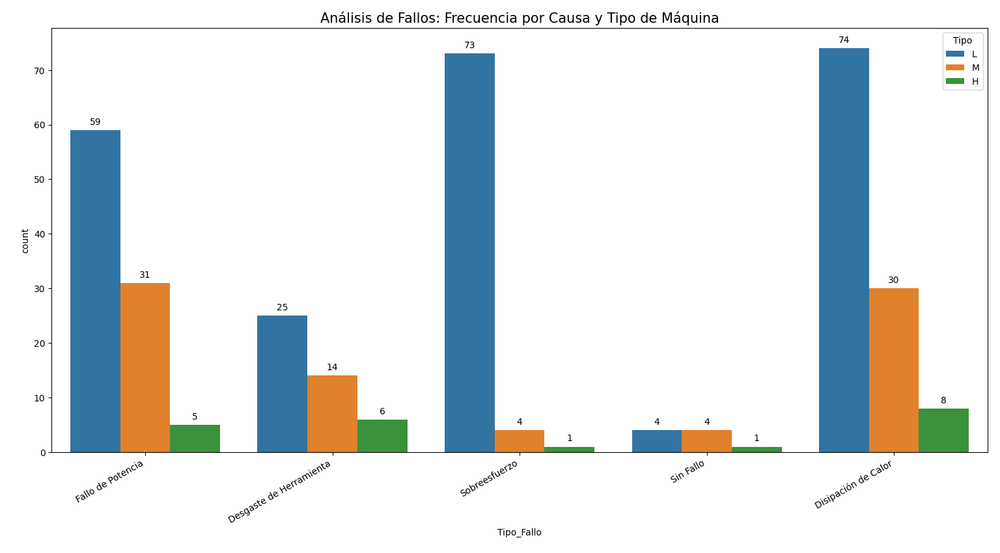
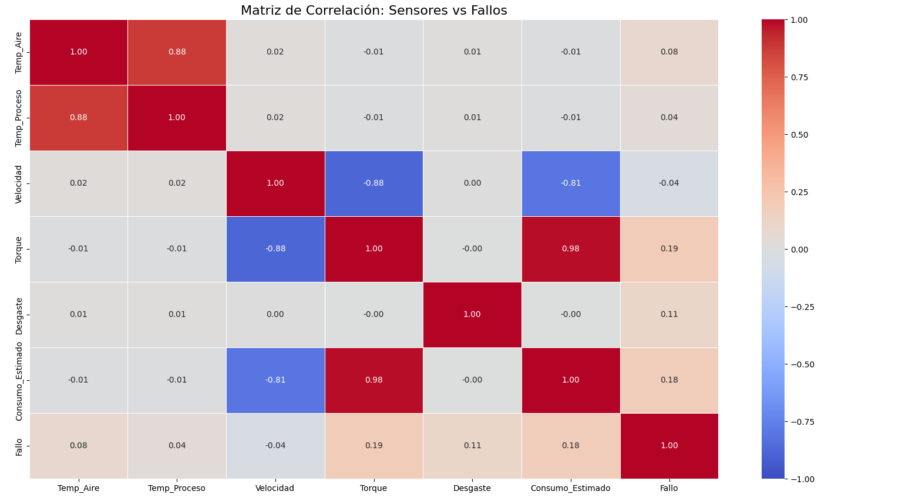

# Proyecto de Monitoreo y Mantenimiento Predictivo

Este proyecto automatiza el ciclo completo de datos (ETL, almacenamiento y análisis) de sensores industriales para identificar patrones de fallo y optimizar el consumo de maquinaria. Basado en un dataset de mantenimiento preventivo, el objetivo es transformar registros brutos en decisiones de negocio.

## Tecnologías utilizadas
* **Python**: Pandas para procesamiento y Seaborn/Matplotlib para visualización.
* **MySQL**: Almacenamiento y gestión de datos relacionales.
* **SQLAlchemy**: Librería para la conexión eficiente entre Python y SQL.

## Hallazgos y Conclusiones del Análisis
Tras procesar 10,000 registros de sensores, se extraen las siguientes conclusiones:

1. **Indicador de Fallo:** Una máquina con consumo ineficiente tiene **3.7 veces más probabilidades de fallar**. El sobreconsumo se establece como el principal KPI preventivo.

2. **Correlación de Consumo:** Existe una relación del **0.98** entre el **Torque** y el **Consumo Estimado**. La optimización del par de fuerza es clave para el ahorro energético.

3. **Fragilidad por Modelo:** Las máquinas de tipo "Low" (L) concentran la mayoría de fallos, destacando causas como el **Sobreesfuerzo** y la **Disipación de Calor**.

4. **Análisis Multivariable:** Aunque la temperatura media en fallo es de **310 K**, su correlación individual con las averías es muy baja (0.04), indicando que el fallo depende de la combinación de múltiples factores.

## Visualizaciones Destacadas

## Estructura del Proyecto
* `data/`: Dataset original de sensores industriales.
* `sql/`: Scripts de creación de tablas en MySQL.
* `scripts/`: 
    * `database_upload.py`: Automatización de la carga de datos.
    * `analisis_visual.py`: Generación de matrices de correlación y gráficos de fallos.
    * `generar_reporte.py`: Exportación de máquinas en estado crítico a CSV.

## Próximos Pasos
* **Fase 4:** Diseño de un Dashboard interactivo en Power BI conectado a la base de datos SQL para monitoreo en tiempo real.